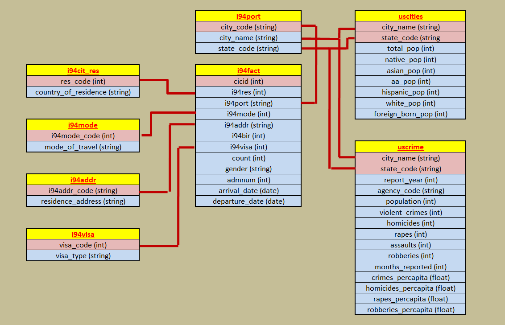

# United States Immigration Data Lake built using Apache Spark
### Data Engineering Capstone Project

#### Project Summary

We wanted to design a datalake which would aid us in analyzing behaviour of travellers entering the United States. We wanted to understand what factors attract travellers to a certain area such as whether it is low crime rates or large population or a large percentage of foreign born residents. We have therefore gathered all the needed data from various sources and added it to our datalake. This data can be easily read by any data analyst who can then run any query required.

The project follows the follow steps:
* Step 1: Scope the Project and Gather Data
* Step 2: Define the Data Model
* Step 3: ETL of i94 Data
    * Explore and Assess the data
    * Data Wrangling and Cleaning
    * Loading onto our datalake
* Step 4: ETL of dimension tables
    * Explore and Assess the data
* Step 5: ETL of US Cities + Population tabe as well as the US Crime data.
    * Explore and Assess the data
* Step 6: Data Quality Checks and Data Dictionary
* Step 7: Complete Project Write Up

### Step 1: Scope the Project and Gather Data

#### Scope 
##### Explain what you plan to do in the project in more detail.
* In our project we plan on building a datalake which will be used by a team of data scientists and data analysts to study behaviour of people travelling to the United States. Primarily, they want to study why travellers prefer some areas over the others but also our dataset allows them to study year wise patterns. Passengers can also be segregated in different age groups or nationalities.

##### What data do you use?
* We have used different datasets. Some provided on the udacity workspace and some gathered from elsewhere.

##### What is your end solution look like? What tools did you use?
* Our end solution is a datalake stored either on Amazon's S3 or local storage as per user's choice and convenience. 
* For our analytical and wrangling needs we have relied on Apache Spark due to its ease of handling large data and its ability to work with various file formats.
* Moreover, where ever possible we have relied on storing our data in the parquet file format. This is a columnar format which allows for high speed reads.

#### Describe and Gather Data 
In our datalake we are using data from different sources.
* Our main fact tabe containing large number of immigration events comes from the US National Tourism and Trade Office. There is a dictionary assosiated with this large dataset that we have used to build up a number of smaller dimension tables.
* Our next major data source is the us-cities-demographic data. This table contains population demographics of a large number of cities in the United States. This data comes to us from OpenSoft. https://public.opendatasoft.com/explore/dataset/us-cities-demographics/export/
* Lastly we are using the uscrimes dataset from kaggle. It contains yearly crime rates in major US jurisdictions. https://www.kaggle.com/ayush1498/analysis-of-us-crime-data 

### Step 2: Define the Data Model

* We will using the i94 events data as our fact table. Our dimension tables will number 7 and these shall be i94addr, i94cit_res, i94mode, i94port, i94visa, uscities, and uscrime.

* The data model designed will be as shown in the pic below.

### Steps 3 to Step 6 are included in our capstone_project_final jupyter notebook.
#### Projec Run Instructions
1. Open the capstone_project_final notebook and go through the cells in order.
2. Make sure you enter the AWS details in dl.cfg if you want to use S3 as a datalake.

### Step 7: Complete Project Write Up

* Clearly state the rationale for the choice of tools and technologies for the project.

    - For our dataengineering capstone project. We have designed a datalake stored on either Amazon's S3 service or a local folder depending on data requirements. We have used Apache Spark to transform and wrangle our data due to the large size of the fact table. (More than 3 million rows). Apache Spark being a distributed software can easily handle large data and perform much better than pandas library.
    - Moreover, in our datalake all files have been stored in the parquet format.

* Propose how often the data should be updated and why.
    - Taking a general use case, the fact table can be updated once or twice a day depending on the volume of events generated. The frequency can also be increased as per business demand.

* Write a description of how you would approach the problem differently under the following scenarios:

 * The data was increased by 100x.
    - If the data were to be increased by 100x then the Apache Spark program should be run on Amazon's EMR cluster on AWS. The number of nodes should be high as well as their processing power. This will ensure fast wrangling of the data.
    - Also, the "s3bool" trigger should be set to True, this will write the output to a datalake on Amazon's S3 service which has near unlimited storage.

 * The data populates a dashboard that must be updated on a daily basis by 7am every day.
    - If the data must be updated every day by 7am then the best solution would be to run the commands on an Apache Airflow dashboard.
    - Different functions performed in this notebook can be divided into tasks and subtasks. Each of these can be scheduled as per their dependencies on AirFlow. Moreover, Airflow will also allow us to parallelize different functions that are not dependent on each other. Another useful feature of AirFlow is email reminders to update us on the status of the pipeline operation.

 * The database needed to be accessed by 100+ people.
 
    - An S3 data lake is the best way to make the data accessible for a large number of people. If we were to instead populate an RDBS on Amazon Redshift, we would incur **high cost** of data transfer and computation. Moreover their will be a slowing down of each query due to overload.
    - Plus we will also create IAM roles for different departments on AWS to ensure segregation of policies.